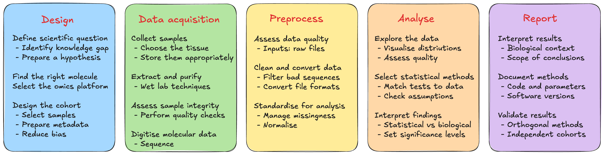

# Module 1.2: The Experimental Workflow

!!! info "Learning objectives"

    - Identify the five stages of an omics study and the key decisions made at each stage
    - Explain how methodological choices at one stage constrain what is possible downstream
    - Recognise common sources of bias, technical variability, and analytical error in omics workflows
    - Apply key design, acquisition, and analysis considerations to their own research context

Omics studies follow a common workflow regardless of the molecular layer being interrogated: from initial study design through data acquisition, preprocessing, analysis, and reporting. The decisions made at each stage are interdependent and choices made upstream constrain what is possible downstream. Further, errors introduced early propagate through the pipeline in ways that cannot always be corrected.

The five stages of an omics study are set out in the figure below. Each stage carries decisions with downstream consequences; understanding what those decisions are and why they matter is the focus of this module.

{width=100%}

---

