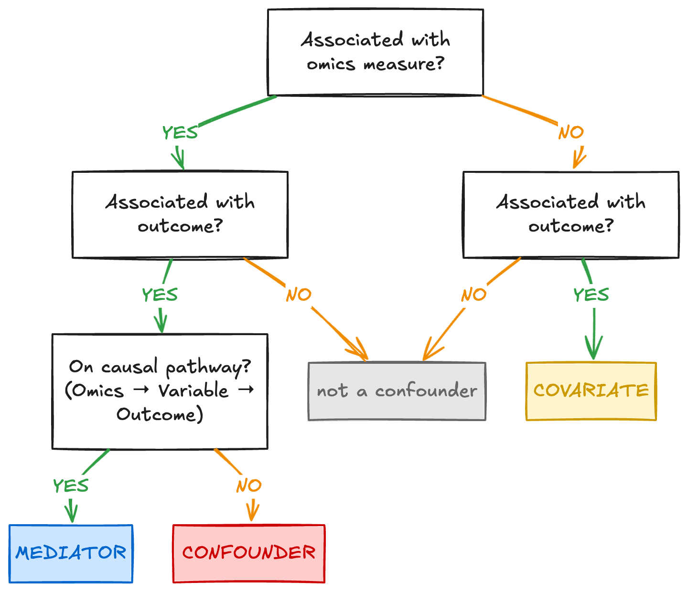

# 2.1.2 Confounding: when a variable travels with your groups

!!! info "Learning objectives"
    - Interpret an example study design to identify when a group difference may be confounded rather than biological
    - Explain why no downstream correction can recover confounded variables 
    - Compare why blocking corrects for batching in named factors, and randomisation for unnamed ones

## Sources of confounding and batch effects

[Consideration 1](module1-2-1.md#consideration-1-cohort-design-and-confounding) and [Consideration 4](module1-2-2#consideration-4-batch-effects) in Module 1 were presented separately because they arise at different points in a study: sampling bias enters during cohort assembly, batch effects during processing. Structurally they are the same failure - an unmeasured variable ends up aligned with the groups being compared. The platform may be appropriate and the measurement technically sound; the problem is that the observed difference cannot be attributed to the biology alone.

When two variables are perfectly aligned in a dataset, they are *confounded*. No comparison within that dataset can attribute a difference to one rather than the other, because there is no case where they vary independently.

Not every variable associated with an omics measurement is a confounder. A covariate is any measured variable that may need to be described, balanced, or included in the analysis, such as age, sex, site, or processing batch. A covariate becomes a confounder when it is associated with both the omics measurement and the outcome being compared, and is not part of the biological pathway between them. A mediator is different: it lies on the causal pathway from the omics measurement to the outcome. Adjusting for a mediator can remove part of the biological effect the study is trying to measure.

Identifying which role a variable plays matters for both accuracy and interpretability. An unrecognised confounder can create a false positive, hide a real effect, or make an effect size appear larger or smaller than it really is, so the numerical result is inaccurate. Treating a mediator as a confounder creates a different problem where the analysis may adjust away part of the biological mechanism under study, making the result harder to interpret. The goal is not to include every available variable in a model, but to decide which variables need to be balanced, recorded, adjusted for, or left out because of their relationship to youre trait or interest and overall study question.

At the design stage, these relationships cannot be tested definitively because the omics data have not yet been generated. The decision can instead be informed by prior biological knowledge, evidence from earlier studies, and advice from domain experts. The decision tree below can help understand your variables. It asks whether a variable is associated with the omics measurement, whether it is also associated with the outcome, and whether it sits on the causal pathway between them to help identify its classification.

{width=90%}

??? tip "[Consideration 1](module1-2-1.md#consideration-1-cohort-design-and-confounding):Cohort design and confounding"
    Molecular profiles are sensitive to many biological and technical variables simultaneously. Age, sex, disease state, medication use, tissue composition, and sample handling conditions can all alter measured signal across every omics layer. A study that does not account for these variables risks attributing their effects to the biological question of interest.

    A confounder that was neither controlled nor recorded cannot be modelled during analysis. If a variable may influence the outcome, measure it at the time of collection.

??? tip "[Consideration 4](module1-2-2#consideration-4-batch-effects): Batch effects"
    A batch effect is a systematic technical bias introduced when samples are processed under different conditions — different sequencing runs, reagent lots, operators, instruments, or processing dates. Unlike random noise, batch effects produce consistent, reproducible patterns in the data that can resemble biological variation or mask it entirely.

    When batch and biological group are perfectly aligned, there is no way to determine which differences are technical and which are real. This design is unrecoverable. When cases and controls are distributed across batches, the batch effect is estimable independently of the biological comparison and can be corrected statistically.

The figure below is reproduced from [Consideration 4](module1-2-2#consideration-4-batch-effects) in Module 1. Batch is the most common version of this problem, and the easiest to draw.

{width=90%}

In the confounded design, cases and controls were processed in separate batches. Nothing in the data distinguishes a separation by batch from a separation by disease. In the distributed design, both groups appear in both batches; the batch effect is estimable and can be adjusted for at analysis. The same figure holds for any factor. 

| Factor | Examples in practice |
|---|---|
| **Sex** | Cases recruited male-skewed, controls female-skewed |
| **Age / recruitment source** | Each group drawn from a different clinic or cohort |
| **Collection year** | Cases collected in 2021, controls added in 2024 |
| **Site** | Multi-site study where one site contributed most of one group |
| **Housing unit** | Treatment in one cage or tank, control in another |
| **Plate position** | Cases in columns 1–4, controls in 5–8 |
| **Operator / sequencing run** | One group processed by one person or on one flow cell |

!!! question "Activity PLACEHOLDER"
    Identify the something.  

---
## Design approaches to mitigate confounding and batch effects

Several design strategies can prevent study groups from becoming confounded with other sources of variation, including matching, stratification, balanced sampling, blocking, and batch allocation. These strategies fall into two broad approaches that either aim to control a factor that is known before the study begins, or distributing samples across a factor that cannot be fully controlled. 

- **Blocking** manages known sources of variation that can be planned for, measured, and included in the allocation, such as processing batch, collection site, sex, or plate. Samples from each group are deliberately allocated across the levels of each factor, so the factor does not become confounded with the comparison of interest.

- **Randomisation** protects against sources of variation that cannot be identified or balanced in advance, such as reagent drift, subtle equipment gradients, or differences in operator technique. Samples are assigned and processed in mixed order so that these unknown factors are unlikely to align systematically with the biological groups.

Neither approach can be applied retrospectively.

The figure below shows all three possibilities for the same 20 samples (10 cases and 10 controls) distributed across two processing batches.

{style="width:90%; height:auto; min-height:300px"}

- **Confounded**: Batch 1 holds all cases, Batch 2 all controls. Batch and biology are the same variable.
- **Blocked**: Each batch holds 5 cases and 5 controls. The batch effect is estimable from within-batch contrasts and can be adjusted for at analysis.
- **Randomised**: Samples are assigned by chance. Balance is approximate rather than guaranteed — at ten samples per group split across two batches, only around a third of random allocations come out exactly balanced, and roughly one in five lands at 7:3 or worse.

For factors that can be identified in advance, **blocking** balances biological groups across their levels. **Randomisation** may achieve a similar balance by chance, but does not ensure it, particularly in small studies. Randomisation however is necessary for sources of variation that cannot be anticipated.

In most omics studies, the biological grouping is fixed - Patients are not randomised to disease status, populations are not randomised to environmental exposure, and fields are not randomised to their soil type. When the exposure cannot be randomised, the available strategies become progressively more limited. The appropriate strategy depends on whether the exposure can be assigned and whether relevant factors can be identified before recruitment or processing.

| Strategy | When it applies | What it provides |
|---|---|---|
| **Randomisation** | The condition is assigned by the researcher: intervention trials, animal studies, field trials, cell culture | Reduces confounding from known and unknown confounders |
| **Stratified randomisation** | The condition is assigned and a factor is known to matter (e.g. sex, site) | Guaranteed balance on that factor; randomisation for the rest |
| **Matching** | Observational; groups already exist | Balance on the matched factors only |
| **Balanced sampling** | Observational; per-individual matching is not practical | Comparable group-level composition without pairwise pairing |
| **Recording** | None of the above is possible | The factor remains estimable at analysis, and nothing more |

Which variables to record, and who records them, will be discussed in a later section.

---

### Randomisation to avoid unknown variation

Randomisation is applied in two steps of experimental design: 

1. When the composition of each group is determined
2. As samples move through the processing workflow

The principle is the same at both stages: biological groups should not travel through a study in blocks, not through recruitment, not through extraction, not across a plate, and not across a sequencing run.

#### Cohort composition

The biological grouping is rarely within the researcher's control. What is within their control is the composition of each group with respect to all other variables.

**Sex.** [Consideration 1](module1-2-1.md#consideration-1-cohort-design-and-confounding) in Module 1 documented the scale of sex-biased expression across tissues. A single-sex study is a limitation on generalisability that can be stated and worked within. A sex-imbalanced two-group comparison is a confounder. Both sexes represented in both groups is what makes the effect estimable.

**Age and recruitment source.** Recruiting each group from a different clinical setting bundles age, medication use, comorbidity burden, and collection protocol into the group label simultaneously. The oncology ward versus community health screen example from Module 1 is representative.

**Shared environment.** Animals housed together, plants in the same tray, or samples stored in the same freezer compartment share more than the condition being studied: microbiome composition, temperature, handling history, and feed. When treatment and control occupy separate housing units, the unit becomes the unit of comparison. Individuals should be randomised to housing units, and where possible each unit should contain samples from more than one condition.

**Collection time and site.** Samples collected in different years or at different sites carry differences in protocol, reagents, and personnel. When one group was collected in 2021 and the other in 2024, no analytical step recovers that comparison.

#### Through the processing workflow

The same principle applies once samples reach the laboratory. Samples that arrive grouped by condition and remain grouped through extraction, library preparation, and sequencing carry their structure all the way to the data.

The goal is not perfect randomness but sufficient mixing that no single technical factor aligns with the biological comparison. Four points where systematic structure accumulates:

**Processing order.** Processing all cases before controls introduces a temporal pattern. Reagent performance and operator precision can vary systematically across a working day. Interleaving conditions across each day's processing order distributes these effects rather than concentrating them.

**Plate layout.** Spatial effects on multi-well plates are well documented: edge wells evaporate at different rates and corner positions behave differently from interior ones. Loading cases into one region of a plate and controls into another converts any spatial gradient into an apparent biological signal. Samples should be randomised across plate positions.

**Library preparation batches.** Running one condition through one preparation batch and another through the next conflates technical batch differences with biological differences. Conditions should be distributed across preparation batches. Where this is not possible, batch becomes a named design factor and must be handled through blocking.

**Sequencing allocation.** Lane effects are real but are rarely the primary source of structure; the more common problem is that earlier grouping carries through to sequencing allocation. Distributing conditions across lanes and flow cells avoids concentrating technical effects.

#### Consequence of skipping this

{width=90%}

<small>**Figure.** Panel A: a temperature gradient across a plate produces an apparent difference between groups because samples were arranged by condition — a false positive arising from spatial confounding. Panel B: samples measured later in a run have more time to accumulate, masking a real difference between conditions — a false negative arising from temporal confounding. In both panels the problem is not the magnitude of technical variation but its alignment with the biological groups. Randomisation breaks that alignment.</small>

<small>Wagner & Kleiner. *Nature Communications* 16, 7263 (2025). [doi:10.1038/s41467-025-62616-x](https://www.nature.com/articles/s41467-025-62616-x){target="_blank"} (CC BY-NC-ND 4.0)</small>

A temperature gradient across a plate is the kind of factor that goes unrecorded. Distributing samples spreads it as noise; grouping samples converts it into signal.

---

### Blocking to manage known sources of Variation

Blocking addresses factors known to vary before processing begins. Rather than relying on chance to distribute them, balance is built into the allocation deliberately.

#### What counts as a batch

A batch is any set of samples processed under shared technical conditions. In omics workflows this arises at multiple stages:

- Samples extracted on the same day, by the same operator, or from the same reagent lot
- Libraries prepared in the same reaction
- Samples run on the same sequencing lane, flow cell, or mass spectrometry injection series
- Samples stored and handled under the same conditions

Batches are a structural feature of how omics studies are conducted; they are unavoidable. The relevant question is not whether batches exist but whether biological groups are distributed across them or confounded with them.

#### The principle

Every biological group must be represented within every batch, as shown in the blocked panel of the figure above. The logic extends to multiple factors: where more than one known factor is in play, every level of every factor should include samples from every biological group. In practice this requires an allocation plan written before any sample is processed, not a decision made at the bench.

A **shared reference sample** — a pooled aliquot prepared from the study samples and carried through every batch — makes batch drift directly measurable rather than inferred. A blocked design ensures the batch effect is estimable; a shared reference quantifies how large it actually is.

{width=90%}

<small>Wagner & Kleiner. *Nature Communications* 16, 7263 (2025). [doi:10.1038/s41467-025-62616-x](https://www.nature.com/articles/s41467-025-62616-x){target="_blank"} (CC BY-NC-ND 4.0)</small>

---

## Design, correction, and interpretation

In an ideal study, confounding and batch effects are prevented at the design stage. Samples are allocated so that biological groups are distributed across known sources of variation, important covariates are recorded, and no technical factor becomes identical to the comparison of interest.

That is not always possible. You may inherit a dataset, reuse public data, work with rare samples, or face budget limits that prevent a full redesign. In those settings, the aim shifts from preventing every problem to understanding which comparisons are still interpretable. Correction methods can help when the technical factor is separated from the biological comparison: when every group appears at every level of the factor, the technical effect can be estimated independently of the biological signal and adjusted for.

When factor and biology are strongly correlated, that separation is limited. When they are perfectly confounded, the model cannot distinguish the two, and any correction risks removing biological signal along with technical variation. The result may still be useful, but its limitations need to be stated clearly: some effects may be overestimated, underestimated, or impossible to attribute to biology alone.

{style="width:90%; height:auto; min-height:300px"}

<small>[Zhu et al. *Genome Medicine* 9, 108 (2017)](https://link.springer.com/article/10.1186/s13073-017-0492-3){target="_blank"}</small>

Correction resolved the batch structure in this example because the design allowed it. The same method applied to a perfectly confounded design would fail — not because the method is worse, but because the information it requires was never generated. The method is the same; the design determines whether it can work and how cautiously the result must be interpreted.

!!! info "Detecting batch structure at analysis"
    An unexplained axis in a PCA plot indicates that structure exists in the data. Identifying what that structure corresponds to depends entirely on whether the variable was recorded. Methods for detecting, evaluating, and correcting batch effects are covered in the downstream analysis workshop. The task of this module is to design studies in which correction is possible, or to recognise the limits of correction when the design has already been set.

---

## The three strategies compared

The table below compares the three allocation strategies across five properties. Blocking typically gives the highest power of the three because removing a known source of variance reduces unexplained noise in the model, balanced allocation improves power as well as interpretability.

| Property | Confounded | Blocked | Randomised |
|---|---|---|---|
| **Batch separable from biology?** | No, they are the same variable | Yes, separated by design | Partially, depends on achieved balance |
| **Correctable at analysis?** | No | Yes | Usually, if batch was recorded |
| **False positive risk** | High | Controlled | Reduced |
| **Statistical power** | Reduced | Typically highest | Good |
| **When to use** | Never | Preferred for any named factor | When the factor cannot be named in advance |

!!! question "Activity PLACEHOLDER"
    Open module 2 activity in your browser. 

!!! info "Module 2.1.2 takeaways"
    - Sampling bias and batch effects are the same structural failure: an unmeasured variable aligned with the groups being compared.
    - A factor perfectly aligned with the biological groups cannot be estimated from the data.
    - Randomisation applies at cohort composition and processing workflow.
    - Blocked designs increase statistical power by reducing unexplained variance.
    - Correction methods require a design in which the technical factor and the biological comparison are not confounded. 
