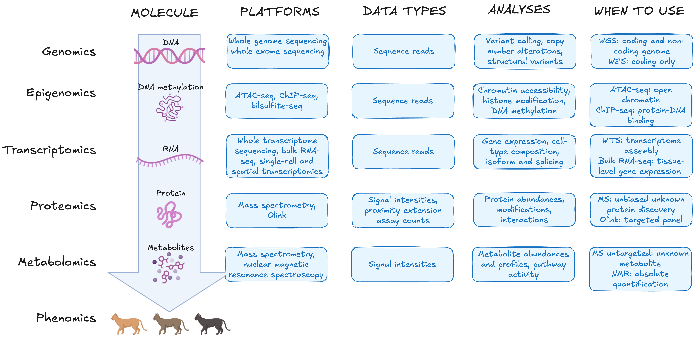

# 2.1 Choosing a measurement platform
 !!! info "Learning objectives"
     - Explain why platform, library-prep, and acquisition decisions must be made before
 data collection and cannot be revisited afterwards
     - Distinguish between sequencing-based platforms (reads) from signal-based platforms
 (intensities)
     - Evaluate a library-preparation and read-length choice against the biological
 features it can and cannot resolve
     - Compare label-free vs labelled quantification, and DDA vs DIA, in terms of the
 missing-value patterns each produces

Module 1.1 mapped the five molecular layers and what each can and cannot capture. Consideration 2 established the governing principle: platform selection follows from the biological question and must be made before data collection begins. This section addresses the next step: which platform or acquisition method within the relevant layer best fits the question.

That choice requires more specificity than the layer alone provides. A question about gene expression and a question about RNA isoforms both sit at the transcriptome, but they require different library strategies and often different platforms to answer.

!!! question "Design question: Are we measuring the biological feature we want to interpret?"

    Platform choice determines not just which molecule is measured, but at
    what resolution (bulk average or individual cells), at what scope
    (discovery or targeted), and with what acquisition strategy. Once
    samples are collected and processed, none of these decisions can be
    revisited.

??? note "Key terms"
    | Term | Definition |
    |---|---|
    | **Library preparation** | The step that converts extracted nucleic acid into sequenceable, barcoded fragments. It determines what the sequencer will see: which RNA fraction, which enrichment strategy, which targets. |
    | **Reads** | The raw nucleotide sequences produced by a sequencer before any alignment or analysis. Each read represents one sequenced fragment from the library. |
    | **Short-read sequencing** | Sequencing technology (e.g. Illumina) producing reads of roughly 50–300 bases. High throughput and accuracy per base; cannot span repetitive regions or structural features longer than one read. |
    | **Long-read sequencing** | Sequencing technology (e.g. PacBio, Oxford Nanopore) producing reads spanning thousands of bases. Resolves full-length isoforms, repetitive regions, and structural variants directly. |
    | **Intensities** | The signal output of mass spectrometry: measured as signal strength as a function of mass-to-charge ratio (m/z). The mass-spectrometric equivalent of read counts in sequencing. |
    | **DDA (data-dependent acquisition)** | An acquisition mode where the instrument selects and fragments the most abundant ions it detects. Favours abundant species; may miss low-abundance targets. |
    | **DIA (data-independent acquisition)** | An acquisition mode where the instrument fragments all ions within predefined m/z windows, regardless of abundance. More consistent sampling across runs at the cost of more complex spectra. |
    | **Multiplexing** | Combining separately barcoded or labelled samples so they can be processed or sequenced together, then computationally separated. Distinct from biological pooling, which merges samples irreversibly. |

---

## Different platforms for different omics

Different biological molecules require different measurement technologies. DNA and RNA can be sequenced directly, whereas proteins and metabolites generally
cannot and are instead measured using approaches such as mass spectrometry or affinity-based assays.

The figure below maps each biological layer to the molecule it targets, the
current most commonly used platforms available to measure it, examples of analyses each enables, and the conditions under which one platform is preferred over another within the same layer.

{width=100%}

!!! question "Activity PLACEHOLDER"
    Read the figure above left to right, but note that the rightmost column is where the design decision sits.

Two patterns are worth noting here: 

1. Sequencing-based platforms all produce reads and signal-based platforms produce intensities. 
2. Within each layer, the platform choice is usually a question of **scope** (the breadth of molecules the assay can detect), **resolution** (the biological unit at which signal is measured), or **analyte class** (the specific molecular species the platform can capture).
---

## Two platform families 

For this module it is useful to think about omics platforms in two broad
families, based on how the biological signal is acquired.

**Sequencing-based platforms** determine the nucleotide sequence of DNA or RNA
molecules, and yield **reads**, which are processed downstream into
the data types you will work with. RNA-seq, single-cell RNA-seq, ATAC-seq, and
microbiome sequencing all sit here.

**Signal-based platforms** measure a physical signal instead, such as
fluorescence or ion abundance, and typically yield **intensities**. Mass
spectrometry (proteomics, metabolomics), microarrays, and imaging-based assays
sit here.

The two acquisition methods generate data in different ways. The next two sections walk through each in turn, sequencing first, then mass spectrometry, so the kind of
number each produces makes sense before you rely on it.

!!! note "Discovery is a design choice"
    Sequencing platforms are often used for discovery, and many signal-based
    platforms measure predefined targets, but the two don't always line up.
    Untargeted mass spectrometry can also support broad discovery, while
    targeted sequencing panels interrogate only pre-selected regions. Whether an
    assay is discovery-driven or targeted is set during study design, not by
    whether it sequences.

---

## Sequencing: generating reads

The molecular layers introduced in Module 1.1 map directly onto what sequencing can measure. DNA sequencing captures a static picture of the genome with its inherited variants, acquired mutations, structural rearrangement events, and copy number changes. RNA sequencing captures something more dynamic: which genes are being expressed, at what level, and in which isoforms, at the moment of sample collection. 

Both of these are measured using **next generation sequencing (NGS)**: a massively parallel technology that allows us to determine the nucleotide sequence of millions of DNA or RNA fragments simultaneously. Sequencing works by: 

1. Breaking DNA or RNA starter material into fragments
2. Converting those fragments into a sequencing-ready library
3. Reading the nucleotide sequence of each fragment as it passes through the instrument which reads millions of fragments in parallel. 

Each sequenced fragment becomes a **read** — a string of nucleotide bases representing one piece of the original molecule. Reads are the raw output of the instrument. All data processing downstream (e.g. alignment, quantification, variant calling) is built on them. What the reads can contain is set entirely by what was put into the library: which molecules were extracted, which fraction was enriched for, how long the fragments are. 

PLACEHOLDER - REPLACE THIS WITH A DIAGRAM OF SEQUENCING PROCESS

{width=100%}

Two decisions made before the instrument runs determine what the reads can
contain: 

1. Library preparation: which molecules, which fraction, which targets. 
2. Read length, which is set by the platform itself and determines what structural features the reads can resolve.

!!! question "Activity: PLACEHOLDER" 
    What activity?

### Decision 1: library preparation

!!! tip "Library preparation is largely standardised" 
    In practice, library preparation is performed using commercial kits with established protocols, and most sequencing facilities offer library preparation as a service. The key decision for you is usually not how to prepare the library but which preparation strategy fits the biological question: poly-A selection versus ribosomal RNA depletion for RNA-seq, for example. Your sequencing provider can advise on the appropriate kit and protocol for your sample type and question before any samples are processed.

Library preparation converts extracted nucleic acid into a form the sequencer can process: fragmented, end-repaired, adapter-ligated, and size-selected fragments that the instrument can bind, amplify, and sequence. This step is where the biological scope of the experiment is defined. The choice of enrichment strategy — whether to capture polyadenylated mRNA, deplete ribosomal RNA from total RNA, select for small RNA species, or perform targeted enrichment of specific loci — determines which molecules will be represented in the reads. Fractions excluded at this stage are absent from the data entirely; a library prepared for polyadenylated mRNA will not report non-polyadenylated species such as lncRNA or enhancer RNA, and cannot be reanalysed to do so.

Where multiple samples are to be sequenced together, a unique molecular barcode is incorporated into each sample's library during preparation. This is **multiplexing**: barcoded libraries are pooled and sequenced in the same run, then separated computationally during analysis. It is distinct from biological pooling, in which samples are combined before any library preparation step, eliminating the ability to distinguish them (Consideration 8).

PLACEHOLDER - A DIAGRAM OF LIBRARY PREPARATION PROCESS

### Decision 2: read length

The second decision is read length, which is determined by the sequencing platform you choose. Platforms from companies such as Illumina, PacBio, and Oxford Nanopore use different underlying sequencing chemistries, and one of the most consequential differences between them is the lengths of reads they produces. Once library preparation has determined which molecules are in the pool, read length determines how much of each molecule the instrument can sequence in a single pass, and therefore which biological features can be directly observed versus reconstructed computationally.

| | **Advantages** | **Limitations** |
|---|---|---|
| **Short-read sequencing** | Higher base-level accuracy | Cannot resolve structural variants, phase alleles, or distinguish highly homologous regions |
| | Lower cost per base, high throughput | Cannot span repetitive regions longer than one read |
| | Suitable for degraded or fragmented input material | Full-length isoforms must be inferred computationally |
| **Long-read sequencing** | Resolves structural rearrangements and homologous regions directly | Lower throughput and higher cost per base |
| | Reads entire RNA transcript to determine isoform directly | More complex bioinformatic processing |
| | Enables de novo genome assembly | |

{width=90%}

**Short-read platforms** (e.g. Illumina) produce reads of roughly 50–300 bases. High throughput and base-level accuracy make them the standard choice for quantifying simple features like gene expression, variant calling, and chromatin accessibility, across large numbers of samples. Their constraint is structural: any feature longer than a single read must be reconstructed computationally from overlapping fragments. Repetitive sequences, structural variants, allele phasing, and full-length RNA isoforms are difficult or impossible to resolve reliably this way, regardless of sequencing depth.

**Long-read platforms** (e.g. PacBio, Oxford Nanopore) produce reads spanning thousands of bases, sufficient to cover entire transcript molecules or large genomic regions in a single read. Full-length isoforms, structural rearrangements, and repetitive or homologous regions are resolved directly rather than inferred. The trade-offs are lower throughput and higher cost per
base, though accuracy on modern long-read platforms is now comparable to short-read sequencing per read.

The choice follows from the biological question. Quantifying gene expression or calling variants across many samples is a short-read problem. Resolving isoform structure, phasing alleles, or characterising structural variation requires long reads. Read length is a structural constraint, not a coverage one — increasing short-read depth cannot recover information that requires spanning a longer molecule.

!!! question "Activity: short or long reads?"

    Decide whether short reads, long reads, (or both) are most suitable for resolving each of the goals:

    1. Identifying a rare single nucleotide variant in a gene you already know to look at.
    2. Assembling a small bacterial genome with numerous structural rearrangements.
    3. Assembling a large vertebrate genome from scratch (de novo).

    ??? success "Answers: reveal after group discussion"
        1. Short reads: low cost per base provides the depth needed to call a rare variant confidently.
        2. Long reads: spanning structural rearrangements needs a single read crossing it to resolve reliably. High coverage and accuracy can still be provided with long reads alone, given small genomes (e.g. of some prokaryotes).
        3. Both! This hybrid approach uses long reads to resolve the genome's repeat regions and structural rearrangements, while short reads allow for affordable and high-accuracy polishing.

---

## Mass spectrometry: generating spectra

Unlike DNA and RNA, proteins and metabolites cannot be sequenced as polymers. Instead, we use mass spectrometry to measure molecules by their mass-to-charge ratio (m/z) and signal intensity. In proteomics, proteins are first digested into peptides, whose fragmentation spectra can be matched to known sequences to identify and quantify the parent protein. In metabolomics, small molecules are measured directly. In both cases the output is **intensities**: signal measured as a function of m/z.

PLACEHOLDER - REPLACE THIS WITH OUR OWN DIAGRAM of the workflow — extract, digest, LC separation, ionisation, MS acquisition, spectrum output

{width=100%}

The most common proteomics workflow is called "bottom-up proteomics, where proteins are extracted and digested into shorter peptide fragments before measurement. 

In the bottom-up proteomics workflow, proteins are extracted from the sample and digested into shorter peptide fragments, typically using trypsin, which cleaves at specific amino acid residues. This digestion step is what distinguishes proteomics from sequencing workflows. The resulting peptides are separated over time by liquid chromatography (LC), which spreads them across a gradient so they reach the instrument at different retention times rather than all at once. They are then ionised and introduced into the mass spectrometer, where they are measured according to their m/z. The output is a spectrum: signal intensity on one axis, m/z on the other. Peptide identity is inferred by matching observed spectra against a reference database of theoretical fragmentation patterns.

!!! tip "Metabolomics takes a similar path"
    Because metabolites are small molecules, there is no need for a digestion step. For LC-MS or GC-MS metabolomics the workflow proceeds directly from extraction to separation, ionisation, and measurement. 
    
    Metabolite identification relies on matching observed m/z values and fragmentation patterns against spectral libraries, though library coverage remains incomplete for many metabolite classes.

Two design decisions made before the run shape what the resulting data can contain and how missing values arise. Neither is visible in the workflow diagram, and one cannot be undone after the run.

### Decision 1: label-free or labelled quantification

Whether samples are acquired using a label-free or a labelling strategy is
decided before the run; the resulting data are then quantified and compared
computationally.

| | **Label-free** | **Labelled** |
|---|---|---|
| **How samples are measured** | Each sample in a separate instrument run | Multiple samples combined and measured in a single run |
| **Chemical modification** | None | Isobaric chemical tags applied before pooling |
| **Sample number limit** | None | Capped by labelling scheme (typically 6–18 per set) |
| **Run-to-run variation** | A source of noise; requires randomised injection order and pooled QC | Eliminated within a set; each set is a separate analytical batch |
| **Batch structure** | Each run is a potential source of technical variation | Each multiplexed set is a batch; groups must be balanced across sets |
| **Instrument time** | One run per sample | Fewer runs; multiple samples per run |
| **Key design requirements** | Randomised injection order; pooled QC samples prepared before the run | Balanced allocation of biological groups across sets |

#### Label-free quantification 

In label-free quantification, each sample is measured in a separate instrument run and protein or metabolite abundances are compared across runs by aligning signal intensities. This approach places no limit on sample number and requires no chemical modification of the sample, but introduces run-to-run instrument variation as a source of noise. Because samples from different biological groups may be measured at different times or on different days, systematic drift in instrument performance can produce abundance differences that are technical rather than biological. This is the batch effect problem described in Consideration 4 in module 1, operating at the level of individual injection runs. 

Two practices mitigate this: 

1. **Injection order should be randomised** with respect to biological group, so that any instrument drift is distributed across groups rather than confounded with them.
2. **pooled QC samples** prepared by combining equal aliquots from all study samples should be injected at regular intervals throughout the run.

Pooled QC injections track instrument performance over time and provide the data needed to assess and correct for drift. They must be prepared before the run begins; they cannot be
reconstructed from the study samples afterwards (Consideration 5).

#### Labelled quantification 

In labelled quantification (e.g. tandem mass tag), samples are chemically tagged with isobaric reagents and combined into a multiplexed set before a single instrument run. Because all samples in a set are measured simultaneously, within-set run-to-run variation is eliminated. The trade-off is that the number of samples per set is capped by the labelling scheme (commonly 6–18 samples per TMT set), each set constitutes a separate analytical batch, and biological groups must be balanced across sets to avoid confounding group differences with batch. Labelled approaches reduce instrument time and within-set technical noise at the cost of throughput and a more complex batch structure to manage.

!!! tip "Neither label or label-free is universally better"
    Label-free quantification suits large sample numbers where instrument time
    is not limiting and within-run consistency can be maintained through
    randomisation and pooled QC. Labelled quantification suits studies where
    within-set consistency is critical and sample numbers fit within the
    multiplexing scheme. The choice depends on study size, available instrument
    time, and sensitivity to run-to-run variation.

### Decision 2: acquisition mode

Once ions enter the instrument, the **acquisition mode** determines which ions are selected for fragmentation and identification. This is set before the run and cannot be changed afterwards.

#### Data-dependent acquisition

In **data-dependent acquisition (DDA)**, the instrument first takes a survey scan of all ions present, then selects the most abundant precursors for fragmentation. The result is that measurement effort is concentrated on the most abundant species. Low-abundance peptides or metabolites may be sampled inconsistently across runs or missed entirely.

#### Data-independent acquisition

In **data-independent acquisition (DIA)**, the instrument fragments all ions within predefined m/z windows, regardless of abundance. Every ion in every window is sampled at every cycle, giving more consistent coverage across runs. The trade-off is more complex spectra that require specialised software to interpret.

PLACEHOLDER DIAGRAM COMPARING THE 2

!!! danger "The unrecoverable rule"
    If an ion was never sampled and fragmented during acquisition, no downstream
    analysis can reconstruct its identity or abundance from the raw data. Not
    detected is not the same as not present. The acquisition mode chosen here
    determines which ions are sampled and how consistently — and therefore which
    molecules may be systematically absent from the data.

This has direct consequences for missing value handling. In DDA, missingness is structured: low-abundance species are disproportionately likely to fall below the selection threshold, and selection itself is stochastic across runs. Missingness in mass spectrometry data can also arise from ionisation efficiency, chromatographic retention, matrix effects, and instrument sensitivity, making it non-random in ways that are not always predictable. Replacing missing values with the sample mean — or any naive imputation — treats absence as a random event and can distort exactly the low-abundance signal a discovery study is designed to detect (Consideration 6). Understanding why values are missing
requires knowing how the data were acquired.

!!! question "Activity: PLACEHOLDER" 
    Labelling and acquisition activity like the sequencing read assembly one above  

---

!!! info "Module 2.1 takeaways"
    - The platform you use must be capable of capturing the specific signal the question depends on, at the required resolution and sensitivity. 
    - In sequencing, fractions not captured during library preparation are absent from the data entirely and cannot be recovered analytically. 
    - In sequencing, short reads cannot resolve full-length isoforms, structural variants, or repetitive regions as well as long reads, regardless of sequencing depth. 
    - In label-free mass spectrometry, randomised injection order and pooled QC injections must be planned and prepared before the run begins. 
    - In mass spectrometry, the choice between DDA and DIA the pattern of missing values in the data.

